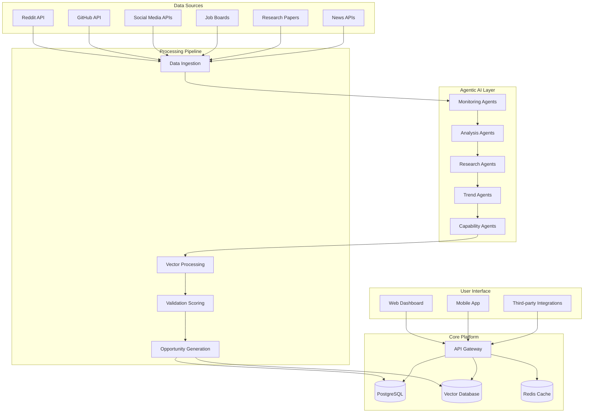

# Design Document

## Overview

The AI Opportunity Browser is an AI-native platform that combines autonomous agent-based discovery with community-driven validation to surface market-proven opportunities specifically solvable by AI technologies. The system architecture emphasizes real-time processing, scalable AI agent orchestration, and multi-source data intelligence to serve entrepreneurs, investors, and companies seeking AI transformation opportunities.

## Architecture

### High-Level Architecture



### Agent Architecture

The system employs specialized AI agents working in coordination:

- **Monitoring Agents**: Continuously scan data sources for pain point signals
- **Analysis Agents**: Score and validate market opportunities
- **Research Agents**: Deep-dive investigation and context gathering
- **Trend Agents**: Pattern recognition and emerging opportunity identification
- **Capability Agents**: AI feasibility assessment and technical roadmap generation

## Components and Interfaces

### 1. Data Ingestion Service

**Purpose**: Real-time data collection from multiple sources
**Technology**: Python/FastAPI with async processing
**Key Features**:
- Rate-limited API clients for each data source
- Webhook receivers for real-time updates
- Data normalization and cleaning pipeline
- Duplicate detection and deduplication

**Interface**:
```python
class DataIngestionService:
    async def ingest_reddit_data(self, subreddits: List[str]) -> List[RawData]
    async def ingest_github_issues(self, repositories: List[str]) -> List[RawData]
    async def ingest_social_media(self, platforms: List[str]) -> List[RawData]
    async def process_webhooks(self, webhook_data: Dict) -> None
```

### 2. Agent Orchestration Engine

**Purpose**: Coordinate and manage AI agent workflows
**Technology**: LangChain/LlamaIndex with custom orchestration
**Key Features**:
- Agent lifecycle management
- Task queue and priority scheduling
- Inter-agent communication protocols
- Performance monitoring and scaling

**Interface**:
```python
class AgentOrchestrator:
    async def deploy_monitoring_agents(self, sources: List[str]) -> List[Agent]
    async def trigger_analysis_workflow(self, raw_data: RawData) -> AnalysisResult
    async def coordinate_research_tasks(self, opportunity: Opportunity) -> ResearchReport
    async def monitor_agent_health(self) -> HealthStatus
```

### 3. Opportunity Intelligence Engine

**Purpose**: Process raw data into validated opportunities
**Technology**: Vector embeddings with semantic search
**Key Features**:
- Semantic similarity detection
- Market validation scoring algorithms
- AI capability matching
- Competitive analysis automation

**Interface**:
```python
class OpportunityEngine:
    async def generate_opportunity(self, signals: List[Signal]) -> Opportunity
    async def validate_market_demand(self, opportunity: Opportunity) -> ValidationScore
    async def assess_ai_feasibility(self, opportunity: Opportunity) -> FeasibilityReport
    async def analyze_competition(self, opportunity: Opportunity) -> CompetitiveAnalysis
```

### 4. Community Validation System

**Purpose**: Enable community-driven opportunity validation
**Technology**: React/Next.js frontend with real-time updates
**Key Features**:
- Expert verification and reputation system
- Crowd-sourced validation workflows
- Gamification and incentive mechanisms
- Quality control and moderation

**Interface**:
```python
class ValidationSystem:
    async def submit_validation(self, user_id: str, opportunity_id: str, validation: Validation) -> ValidationResult
    async def calculate_reputation_score(self, user_id: str) -> ReputationScore
    async def aggregate_community_feedback(self, opportunity_id: str) -> CommunityScore
    async def detect_validation_fraud(self, validations: List[Validation]) -> FraudReport
```

### 5. Business Intelligence Service

**Purpose**: Generate market insights and ROI analysis
**Technology**: Python data science stack (pandas, scikit-learn)
**Key Features**:
- Market sizing and trend analysis
- ROI projection modeling
- Business model recommendations
- Implementation timeline estimation

**Interface**:
```python
class BusinessIntelligenceService:
    async def analyze_market_size(self, opportunity: Opportunity) -> MarketAnalysis
    async def project_roi(self, opportunity: Opportunity, investment: Investment) -> ROIProjection
    async def recommend_business_model(self, opportunity: Opportunity) -> BusinessModel
    async def estimate_implementation_timeline(self, opportunity: Opportunity) -> Timeline
```

## Data Models

### Core Entities

```python
@dataclass
class Opportunity:
    id: str
    title: str
    description: str
    market_signals: List[MarketSignal]
    validation_score: float
    ai_feasibility_score: float
    market_size_estimate: MarketSize
    competition_analysis: CompetitiveAnalysis
    implementation_guidance: ImplementationGuide
    created_at: datetime
    updated_at: datetime

@dataclass
class MarketSignal:
    source: str  # reddit, github, social_media, etc.
    signal_type: str  # pain_point, feature_request, complaint
    content: str
    engagement_metrics: EngagementMetrics
    sentiment_score: float
    confidence_level: float
    extracted_at: datetime

@dataclass
class ValidationResult:
    opportunity_id: str
    validator_id: str
    validation_type: str  # market_demand, technical_feasibility, business_viability
    score: float  # 1-10 scale
    comments: str
    evidence_links: List[str]
    validated_at: datetime

@dataclass
class AICapabilityAssessment:
    opportunity_id: str
    required_capabilities: List[str]  # nlp, computer_vision, ml, etc.
    current_model_availability: Dict[str, ModelAvailability]
    implementation_complexity: ComplexityLevel
    estimated_development_time: timedelta
    technical_risks: List[TechnicalRisk]

@dataclass
class ImplementationGuide:
    opportunity_id: str
    technical_architecture: TechnicalArchitecture
    development_phases: List[DevelopmentPhase]
    required_team_skills: List[str]
    estimated_budget: BudgetEstimate
    go_to_market_strategy: GTMStrategy
```

### Database Schema

**PostgreSQL Tables**:
- `opportunities` - Core opportunity data
- `market_signals` - Raw market signal data
- `validations` - Community validation records
- `users` - User profiles and reputation
- `ai_capabilities` - AI model and capability tracking
- `implementation_guides` - Technical implementation details

**Vector Database (Pinecone)**:
- Opportunity embeddings for semantic search
- Market signal embeddings for similarity detection
- User preference embeddings for personalization

## Error Handling

### Error Categories and Strategies

**1. Data Source Failures**
- **Strategy**: Graceful degradation with fallback sources
- **Implementation**: Circuit breaker pattern with exponential backoff
- **Monitoring**: Real-time alerts for source availability

**2. AI Agent Failures**
- **Strategy**: Agent redundancy and automatic failover
- **Implementation**: Health checks and automatic restart mechanisms
- **Monitoring**: Agent performance metrics and error tracking

**3. Validation System Abuse**
- **Strategy**: Multi-layer fraud detection and rate limiting
- **Implementation**: ML-based anomaly detection and reputation weighting
- **Monitoring**: Validation pattern analysis and user behavior tracking

**4. API Rate Limiting**
- **Strategy**: Intelligent request queuing and caching
- **Implementation**: Redis-based rate limiting with priority queues
- **Monitoring**: API usage analytics and performance optimization

### Error Response Format

```python
@dataclass
class ErrorResponse:
    error_code: str
    error_message: str
    error_details: Dict[str, Any]
    retry_after: Optional[int]
    support_reference: str
    timestamp: datetime
```

## Testing Strategy

### Testing Pyramid

**1. Unit Tests (70%)**
- Individual agent logic testing
- Data processing function validation
- Business logic verification
- Mock external API responses

**2. Integration Tests (20%)**
- Agent coordination workflows
- Database integration testing
- API endpoint validation
- Real-time data pipeline testing

**3. End-to-End Tests (10%)**
- Complete user journey validation
- Cross-system integration verification
- Performance and load testing
- Security penetration testing

### Testing Tools and Frameworks

- **Unit Testing**: pytest with async support
- **Integration Testing**: Docker Compose test environments
- **Load Testing**: Locust for performance testing
- **Security Testing**: OWASP ZAP for vulnerability scanning
- **Monitoring**: Prometheus + Grafana for observability

### Test Data Management

- **Synthetic Data Generation**: Factory patterns for test data
- **Data Anonymization**: PII scrubbing for production data testing
- **Test Environment Isolation**: Separate databases and API keys
- **Continuous Testing**: Automated test execution in CI/CD pipeline

### Performance Testing Scenarios

1. **High-Volume Data Ingestion**: 10,000+ signals per minute
2. **Concurrent User Load**: 1,000+ simultaneous users
3. **Agent Scaling**: Dynamic agent deployment under load
4. **Database Performance**: Query optimization under stress
5. **API Response Times**: Sub-3-second response requirements

## Future-Proofing and Scalability Enhancements

### Event-Driven Architecture

**Implementation**: Apache Kafka or AWS EventBridge for service communication
**Benefits**: 
- Decoupled service communication
- Event sourcing capabilities for audit trails
- Improved system resilience and fault tolerance
- Support for real-time streaming analytics

```python
class EventBus:
    async def publish_event(self, event_type: str, payload: Dict) -> None
    async def subscribe_to_events(self, event_types: List[str], handler: EventHandler) -> None
    async def replay_events(self, from_timestamp: datetime) -> AsyncIterator[Event]
```

### Configuration Management Service

**Implementation**: HashiCorp Consul or AWS Parameter Store
**Features**:
- Environment-specific configuration management
- Dynamic configuration updates without restarts
- Configuration versioning and rollback capabilities
- Secrets management integration

```python
class ConfigurationService:
    async def get_config(self, key: str, environment: str) -> ConfigValue
    async def update_config(self, key: str, value: Any, environment: str) -> None
    async def watch_config_changes(self, keys: List[str]) -> AsyncIterator[ConfigChange]
```

### Plugin Architecture for Data Sources

**Implementation**: Dynamic plugin loading with standardized interfaces
**Benefits**:
- Easy addition of new data sources without code changes
- Third-party plugin development support
- Runtime plugin management and hot-swapping

```python
class DataSourcePlugin(ABC):
    @abstractmethod
    async def initialize(self, config: Dict) -> None
    @abstractmethod
    async def fetch_data(self, params: Dict) -> List[RawData]
    @abstractmethod
    def get_metadata(self) -> PluginMetadata

class PluginManager:
    async def load_plugin(self, plugin_path: str) -> DataSourcePlugin
    async def register_plugin(self, plugin: DataSourcePlugin) -> None
    async def list_available_plugins(self) -> List[PluginMetadata]
```

### Multi-Model AI Abstraction Layer

**Implementation**: Unified interface for different AI providers and models
**Features**:
- Provider-agnostic AI model access
- Automatic failover between AI providers
- Cost optimization through provider selection
- Model performance monitoring and comparison

```python
class AIModelAbstraction:
    async def generate_completion(self, prompt: str, model_config: ModelConfig) -> CompletionResult
    async def generate_embeddings(self, text: List[str], model_config: ModelConfig) -> List[Vector]
    async def analyze_sentiment(self, text: str, model_config: ModelConfig) -> SentimentResult
    async def get_available_models(self, capability: str) -> List[ModelInfo]
```

### Observability and Monitoring Layer

**Implementation**: OpenTelemetry with Jaeger/Zipkin for tracing
**Features**:
- Distributed tracing across all services
- Custom metrics collection and alerting
- Performance bottleneck identification
- Service dependency mapping

```python
class ObservabilityService:
    async def trace_operation(self, operation_name: str, context: TraceContext) -> TraceSpan
    async def record_metric(self, metric_name: str, value: float, tags: Dict) -> None
    async def create_alert(self, condition: AlertCondition, notification: NotificationConfig) -> Alert
```

### Feature Flag Management

**Implementation**: LaunchDarkly or custom feature flag service
**Benefits**:
- Gradual feature rollouts and A/B testing
- Quick feature toggles without deployments
- User segmentation for targeted features
- Performance impact monitoring

```python
class FeatureFlagService:
    async def is_feature_enabled(self, flag_name: str, user_context: UserContext) -> bool
    async def get_feature_variant(self, flag_name: str, user_context: UserContext) -> FeatureVariant
    async def track_feature_usage(self, flag_name: str, user_id: str, outcome: str) -> None
```

### API Versioning Strategy

**Implementation**: Semantic versioning with backward compatibility
**Features**:
- Multiple API version support
- Gradual deprecation workflows
- Client SDK auto-generation
- Version usage analytics

```python
class APIVersionManager:
    async def route_request(self, version: str, endpoint: str, request: Request) -> Response
    async def deprecate_version(self, version: str, sunset_date: datetime) -> None
    async def generate_client_sdk(self, version: str, language: str) -> SDKPackage
```

## Security and Privacy Considerations

### Data Protection
- **Encryption**: AES-256 encryption at rest and TLS 1.3 in transit
- **Access Control**: Role-based permissions with JWT authentication
- **Data Retention**: Automated data lifecycle management
- **Privacy Compliance**: GDPR and CCPA compliance frameworks

### API Security
- **Rate Limiting**: Per-user and per-endpoint rate limits
- **Input Validation**: Comprehensive input sanitization
- **Authentication**: Multi-factor authentication for sensitive operations
- **Monitoring**: Real-time security event detection and alerting

### Enhanced Security Features
- **Zero Trust Architecture**: Service-to-service authentication and authorization
- **Data Classification**: Automated PII detection and handling
- **Audit Logging**: Comprehensive audit trails for all system operations
- **Vulnerability Scanning**: Automated security scanning in CI/CD pipeline