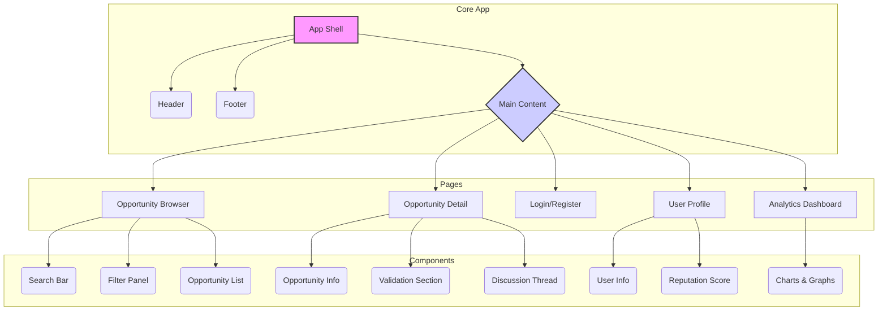

# UI Development Plan

## Introduction

After a thorough review of the project's documentation (`tasks.md`, `requirements.md`, and `design.md`), it is clear that while the backend is robust and feature-rich, the UI has not been planned out. The `design.md` file explicitly mentions a "Web Dashboard" built with "React/Next.js" as part of the architecture.

This document outlines a strategic plan for the UI development, designed to be modular and allow for iterative development and deployment.

## Proposed UI Development Plan

The UI will be developed in phases, starting with the core features and progressively adding more advanced functionality.

### Phase 1: Core UI & Opportunity Browser

This phase focuses on building the foundational components of the web application, allowing users to browse and interact with the core content.

*   **Key Features:**
    *   Opportunity browsing, searching, and filtering.
    *   Detailed opportunity view.
    *   User authentication (registration and login).
    *   Personalized collections to save opportunities.

### Phase 2: Community Engagement & Validation

This phase will bring the community aspects of the platform to life, enabling user interaction and validation of opportunities.

*   **Key Features:**
    *   User profile pages with expertise and reputation.
    *   Opportunity validation workflow.
    *   Discussion forums and commenting on opportunities.

### Phase 3: Business Intelligence & Networking

This phase will introduce advanced analytics and networking features, providing deeper insights and fostering collaboration.

*   **Key Features:**
    *   Analytics dashboard with market trends and ROI projections.
    *   User matching for team formation.
    *   Messaging system for user communication.

## UI Component Architecture

The following diagram illustrates the high-level component architecture for the proposed web dashboard:



## API Integration Strategy

The UI will integrate with the existing FastAPI backend through the following established endpoints:

### Core API Endpoints
- **Authentication**: `/auth/register`, `/auth/login`, `/auth/refresh`
- **Opportunities**: `/opportunities/` (CRUD, search, recommendations)
- **Users**: `/users/me`, `/users/{user_id}`, `/users/interactions`
- **Validations**: `/validations/` (submit, vote, moderate)
- **Discussions**: `/discussions/` (create, comment, vote)
- **Business Intelligence**: `/business-intelligence/` (analytics, ROI projections)

### HTTP Client Configuration
```typescript
// api/client.ts
import axios from 'axios';

const apiClient = axios.create({
  baseURL: process.env.NEXT_PUBLIC_API_URL || 'http://localhost:8000',
  timeout: 10000,
});

// JWT token interceptor
apiClient.interceptors.request.use((config) => {
  const token = localStorage.getItem('access_token');
  if (token) {
    config.headers.Authorization = `Bearer ${token}`;
  }
  return config;
});
```

## State Management Architecture

### Global State with Zustand
```typescript
// stores/authStore.ts
interface AuthState {
  user: User | null;
  token: string | null;
  login: (credentials: LoginCredentials) => Promise<void>;
  logout: () => void;
}

// stores/opportunityStore.ts  
interface OpportunityState {
  opportunities: Opportunity[];
  filters: OpportunityFilters;
  loading: boolean;
  searchOpportunities: (query: string) => Promise<void>;
  setFilters: (filters: OpportunityFilters) => void;
}
```

### Component State Management
- **Local state**: useState for component-specific data
- **Server state**: React Query for API data caching and synchronization
- **Form state**: React Hook Form for complex forms

## Real-time Features Integration

### WebSocket Connection
```typescript
// hooks/useWebSocket.ts
const useWebSocket = (endpoint: string) => {
  useEffect(() => {
    const ws = new WebSocket(`ws://localhost:8000/ws/${endpoint}`);
    
    ws.onmessage = (event) => {
      const data = JSON.parse(event.data);
      // Handle real-time updates
    };
    
    return () => ws.close();
  }, [endpoint]);
};
```

### Real-time Features
- **Validation Updates**: Live validation score changes
- **Discussion Updates**: New comments and votes
- **Notification System**: Real-time alerts for user activities
- **Opportunity Updates**: Live opportunity status changes

## Testing Strategy

### Testing Framework Setup
```json
// package.json
{
  "devDependencies": {
    "jest": "^29.0.0",
    "@testing-library/react": "^13.0.0",
    "@testing-library/jest-dom": "^5.16.0",
    "@testing-library/user-event": "^14.0.0",
    "cypress": "^12.0.0"
  }
}
```

### Testing Pyramid
1. **Unit Tests (70%)**: Component logic, utilities, hooks
2. **Integration Tests (20%)**: API integration, user flows
3. **E2E Tests (10%)**: Critical user journeys with Cypress

### Test Examples
```typescript
// __tests__/OpportunityCard.test.tsx
describe('OpportunityCard', () => {
  it('displays opportunity information correctly', () => {
    render(<OpportunityCard opportunity={mockOpportunity} />);
    expect(screen.getByText(mockOpportunity.title)).toBeInTheDocument();
  });
});

// cypress/e2e/opportunity-browser.cy.ts
describe('Opportunity Browser', () => {
  it('allows users to search and filter opportunities', () => {
    cy.visit('/opportunities');
    cy.get('[data-testid="search-input"]').type('AI chatbot');
    cy.get('[data-testid="opportunity-card"]').should('be.visible');
  });
});
```

## Technology Stack Details

### Core Dependencies
- **Framework**: Next.js 14 with App Router
- **Styling**: Tailwind CSS + Shadcn/ui components
- **State Management**: Zustand for global state
- **Data Fetching**: React Query (TanStack Query)
- **Forms**: React Hook Form with Zod validation
- **Charts**: Recharts for analytics visualizations
- **WebSocket**: Native WebSocket API with custom hooks

### Development Tools
- **TypeScript**: Full type safety
- **ESLint + Prettier**: Code quality and formatting
- **Husky**: Git hooks for pre-commit checks
- **Storybook**: Component documentation and testing

## Next Steps

This enhanced plan provides a comprehensive roadmap for UI development with detailed technical specifications. The implementation should proceed through the three phases with proper API integration, state management, real-time features, and comprehensive testing coverage.