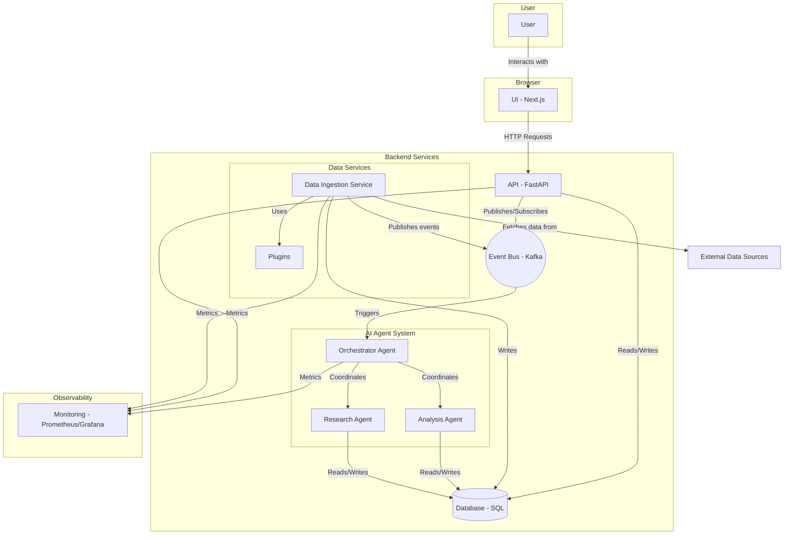

# AI Opportunity Browser - Architectural Overview

This document provides a high-level overview of the AI Opportunity Browser's architecture, based on an analysis of the project's directory and file structure.

## 1. System Components

The application is structured as a modern, multi-component system with a clear separation of concerns. The primary components are:

*   **UI (`ui/`)**: The web-based frontend that users interact with.
*   **API (`api/`)**: The backend server that handles business logic and data access.
*   **AI Agents (`agents/`)**: A collection of specialized AI agents for analysis, research, and planning.
*   **Data Ingestion (`data-ingestion/`)**: Services responsible for collecting and processing data from external sources.
*   **Shared Services (`shared/`)**: A library of common code and utilities used by the backend components.
*   **Monitoring (`monitoring/`)**: Infrastructure for system monitoring, logging, and alerting.

---

## 2. Component Details and Technology Stack

### 2.1. UI (Frontend)

*   **Directory**: `ui/`
*   **Description**: This is the user-facing application. It allows users to browse, search, and analyze AI-related opportunities.
*   **Inferred Technology Stack**:
    *   **Framework**: [Next.js](https://nextjs.org/) (a React framework)
    *   **Language**: [TypeScript](https://www.typescriptlang.org/) (`.tsx` files)
    *   **Styling**: Likely CSS-in-JS or a utility-first framework like Tailwind CSS (`globals.css`).
    *   **UI Components**: A component-based architecture is evident from the `ui/src/components/` directory. The presence of `components.json` suggests the use of a framework like [shadcn/ui](https://ui.shadcn.com/).

### 2.2. API (Backend)

*   **Directory**: `api/`
*   **Description**: The API server acts as the central hub, handling requests from the UI, orchestrating AI agents, and managing data persistence. It exposes a RESTful interface for various application resources.
*   **Inferred Technology Stack**:
    *   **Framework**: [FastAPI](https://fastapi.tiangolo.com/) (a modern, high-performance Python web framework). This is inferred from the directory structure (`routers/`, `middleware/`) and Python files.
    *   **Language**: [Python](https://www.python.org/)
    *   **Database/ORM**: [SQLAlchemy](https://www.sqlalchemy.org/) with [Alembic](https://alembic.sqlalchemy.org/) for database migrations (inferred from `alembic.ini` and the `alembic/` directory). This typically points to a relational database like PostgreSQL.

### 2.3. AI Agents

*   **Directory**: `agents/`
*   **Description**: This component contains the core AI-driven logic. It appears to be a multi-agent system where different agents have specialized roles (e.g., analysis, research, planning). An orchestrator agent likely coordinates their activities.
*   **Inferred Technology Stack**:
    *   **Language**: [Python](https://www.python.org/)
    *   **AI Framework**: [DSPy](https://github.com/stanfordnlp/dspy) (inferred from `dspy_modules.py`), a framework for programming with language models.

### 2.4. Data Ingestion

*   **Directory**: `data-ingestion/`
*   **Description**: This component is responsible for gathering data from various sources. The `plugins/` and `processing/` subdirectories suggest a flexible, extensible architecture for adding new data sources and defining data transformation pipelines.
*   **Inferred Technology Stack**:
    *   **Language**: [Python](https://www.python.org/)

### 2.5. Shared Services

*   **Directory**: `shared/`
*   **Description**: This is a common library containing code shared across the Python-based components (`api`, `agents`, `data-ingestion`). It centralizes core functionalities like database connections, event handling, configuration, and business logic services.
*   **Inferred Technology Stack**:
    *   **Language**: [Python](https://www.python.org/)
    *   **Event Bus**: An event-driven architecture is suggested by `event_bus.py` and `event_bus_kafka.py`, likely using [Apache Kafka](https://kafka.apache.org/) for asynchronous communication between services.

### 2.6. Monitoring

*   **Directory**: `monitoring/`
*   **Description**: This component provides observability into the system's health and performance.
*   **Inferred Technology Stack**:
    *   **Metrics**: [Prometheus](https://prometheus.io/) (`prometheus.yml`)
    *   **Dashboards**: [Grafana](https://grafana.com/) (`grafana/`)
    *   **Alerting**: [Alertmanager](https://prometheus.io/docs/alerting/latest/alertmanager/) (`alertmanager.yml`)

---

## 3. Architectural Diagram and Data Flow

The following diagram illustrates the likely relationships and data flow between the components.

**Data Flow Summary:**

1.  **Data Collection**: The **Data Ingestion** service uses its **Plugins** to fetch data from external sources, processes it, and stores it in the central **Database**. It may also publish events to the **Event Bus**.
2.  **User Interaction**: The **User** interacts with the **UI**. The UI sends requests to the **API**.
3.  **API Handling**: The **API** processes requests, reading from or writing to the **Database**. For complex, AI-driven tasks, it publishes an event to the **Event Bus**.
4.  **AI Processing**: The **Orchestrator Agent** listens for events on the Event Bus and coordinates the other **AI Agents** (Analysis, Research) to perform the required tasks. These agents read data from and write their results back to the **Database**.
5.  **Data Presentation**: The **API** exposes endpoints that the **UI** can poll or subscribe to (e.g., via WebSockets) to get the results of the AI processing, which are then displayed to the user.
6.  **Monitoring**: All backend services send metrics to the **Monitoring** stack, providing visibility into the system's operational health.