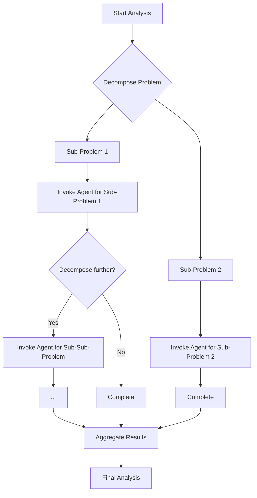
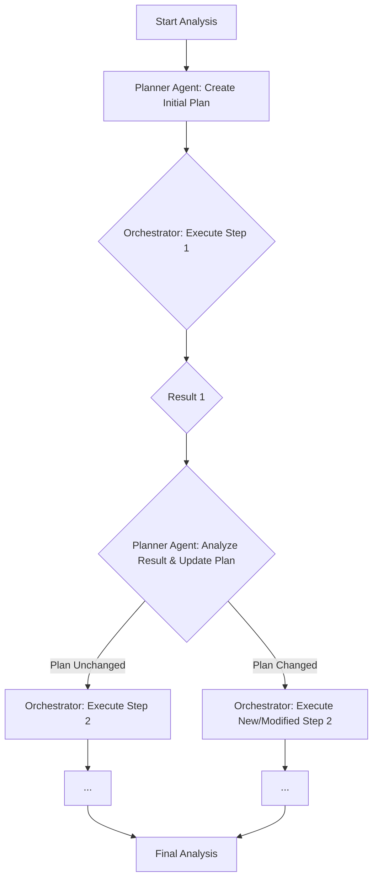
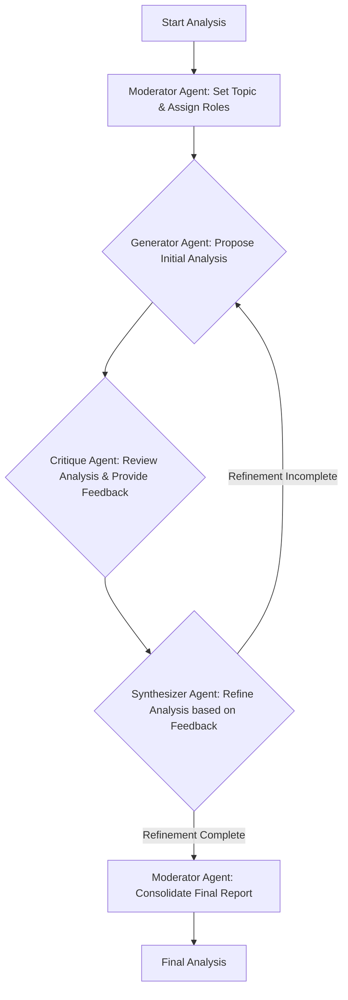

# Architectural Proposal: Enabling Deep Work for Opportunity Analysis

This document outlines architectural patterns to enhance the AI Opportunity Browser's agentic system, moving from predefined workflows to a more dynamic "deep work" model.

## 1. Architectural Pattern: Recursive Agent Loops

### a. Concept

This pattern allows an agent to break down a complex problem into smaller, self-contained sub-problems and delegate them to other agents, or even to itself. The agent acts as a "meta-agent" that can reason about a task, decompose it, and initiate sub-tasks. This process can continue recursively until a terminal condition (e.g., goal achieved, depth limit reached) is met.

### b. Analysis

**Pros:**

*   **Depth of Analysis:** Enables a level of detail limited only by predefined constraints (like depth or budget), not by a static workflow definition.
*   **Flexibility:** Agents can adapt their approach based on intermediate findings, pursuing promising avenues of investigation that weren't planned initially.
*   **Simplicity of Implementation:** Can be built on top of the existing `BaseAgent` and `AgentTask` structure. The core change is allowing an agent's `process_task` method to create and dispatch new `AgentTask`s.

**Cons:**

*   **Control and Predictability:** High risk of infinite loops or exponential task creation. Requires robust control mechanisms, such as:
    *   **Depth Limits:** Hard cap on recursion depth.
    *   **Budget/Token Limits:** Stop execution when a cost threshold is exceeded.
    *   **State Tracking:** Detect and prevent cyclical task dependencies.
*   **Result Synthesis:** Aggregating results from a deep, branching tree of tasks can be complex. A clear data structure for the "call stack" and results is needed.
*   **Error Propagation:** An error in a deeply nested task could cascade and cause the entire analysis to fail.

### c. Impact on Existing Codebase

*   **[`agents/base.py`](agents/base.py:0):**
    *   The `AgentTask` class might need a `parent_task_id` and `depth` field to manage the recursive structure.
    *   Agents would need access to the orchestrator's task submission functionality, or a shared queue, to spawn new tasks. This breaks the current model where only the orchestrator dispatches tasks.
*   **[`agents/orchestrator.py`](agents/orchestrator.py:0):**
    *   The concept of a static, predefined `Workflow` becomes less relevant for these dynamic tasks. The orchestrator would need to be adapted to track these emergent, tree-like task structures rather than linear DAGs.
    *   It would need to manage the control mechanisms (depth, budget) and aggregate the final results.

## 2. Architectural Pattern: Dynamic Workflow Generation

### a. Concept

This pattern introduces a "Planner Agent" that constructs a new workflow graph on the fly, based on the initial problem and intermediate results. Instead of a static, predefined workflow, the orchestrator executes a plan that can evolve. After each step, the Planner Agent can re-evaluate the plan and add, remove, or modify subsequent steps.

### b. Analysis

**Pros:**

*   **Structured yet Flexible:** Maintains the explicit, manageable nature of a workflow graph while allowing for dynamic adaptation. This offers more predictability than pure recursion.
*   **High-Level Control:** The Planner Agent has a holistic view of the process, allowing it to make strategic decisions about the overall analysis path.
*   **Auditability:** The generated workflow provides a clear, step-by-step record of the agent's "reasoning" process, which is valuable for debugging and understanding the results.

**Cons:**

*   **Planner Agent Complexity:** The Planner Agent itself is a complex component. It needs to be sophisticated enough to reason about the problem, available tools/agents, and intermediate results to generate effective plans.
*   **Potential for Inefficiency:** The planning step adds overhead. If the agent re-evaluates the plan too frequently, it can slow down the analysis.
*   **State Management:** The orchestrator needs to manage the state of the dynamically evolving workflow, which is more complex than a static one.

### c. Impact on Existing Codebase

*   **[`agents/base.py`](agents/base.py:0):**
    *   A new `PlannerAgent` type would need to be created.
    *   No significant changes to the `BaseAgent` or `AgentTask` are necessarily required, as the planner's output would be a standard `Workflow` structure.
*   **[`agents/orchestrator.py`](agents/orchestrator.py:0):**
    *   The `_execute_workflow` method would need to be modified to incorporate the planning loop. Instead of just executing a static list of steps, it would execute one step, return the result to the Planner, receive a new plan, and continue.
    *   The `Workflow` object might need a `version` or `history` attribute to track how it evolves over time.

## 3. Architectural Pattern: Multi-Agent Collaboration (Debate/Critique)

### a. Concept

This pattern involves multiple agents working on the same problem from different perspectives. One agent might generate an initial analysis, while another critiques it, and a third synthesizes the results. This creates an iterative loop of feedback and refinement that can lead to a more robust and well-vetted conclusion. This is often modeled as a "round-table" discussion.

### b. Analysis

**Pros:**

*   **High-Quality Output:** The adversarial or collaborative nature of the process can uncover biases, identify weaknesses, and lead to a more comprehensive and reliable result.
*   **Diverse Perspectives:** By assigning different "personas" or specialized roles to the agents (e.g., "optimist," "pessimist," "data-driven analyst"), the system can explore a problem from multiple angles.
*   **Reduced Hallucinations:** The critique step acts as a built-in fact-checker and sense-checker, reducing the likelihood of erroneous conclusions.

**Cons:**

*   **Communication Overhead:** Requires a robust inter-agent communication protocol. The current system passes data through workflow results, but a more direct messaging or shared memory system (e.g., a "blackboard") might be needed.
*   **Convergence Issues:** The debate could fail to converge on a conclusion, leading to an endless loop. A "Moderator" or "Tie-breaker" agent is essential to manage the process and decide when a conclusion is "good enough."
*   **Cost:** This is potentially the most computationally expensive model, as multiple agents are processing the same information, and multiple iterations may be required.

### c. Impact on Existing Codebase

*   **[`agents/base.py`](agents/base.py:0):**
    *   Agents would need a way to communicate more directly. This could be a shared data object, a reference to a central "discussion" object, or an event-based system.
    *   The `AgentTask` might need to be extended to include context about the ongoing "conversation."
*   **[`agents/orchestrator.py`](agents/orchestrator.py:0):**
    *   The orchestrator would take on the role of the "Moderator." It would need to manage the conversational turn-taking, check for convergence, and manage the overall state of the debate.
    *   The linear, dependency-based `_execute_workflow` logic is not a good fit. A new execution model based on iterative rounds of discussion would be required.

## 4. Comparative Analysis

| Feature | Recursive Agent Loops | Dynamic Workflow Generation | Multi-Agent Collaboration |
| :--- | :--- | :--- | :--- |
| **Implementation Complexity** | Low to Medium | Medium to High | High |
| **Control & Predictability** | Low (requires strict guards) | Medium | Medium (requires moderator) |
| **Potential for Depth** | Very High | High | Medium to High |
| **Quality of Analysis** | Variable (depends on agent logic) | High (structured) | Very High (vetted) |
| **Code Impact** | Medium (breaks orchestrator pattern) | Low (builds on existing patterns) | High (requires new communication model) |
| **Cost/Efficiency** | High (risk of exponential growth) | Medium (planner overhead) | Very High (multiple agents, iterations) |

## 5. High-Level Recommendation

For the initial implementation of "deep work" capabilities, I recommend pursuing the **Dynamic Workflow Generation** pattern.

### Justification:

This approach offers the best balance between flexibility and control. It allows the system to move beyond static workflows and adapt to new information, which is the core requirement. However, it does so within a structured and observable framework, which mitigates the significant control and cost risks associated with pure recursive loops.

*   **Pragmatic First Step:** It builds naturally on the existing `Workflow` and `Orchestrator` concepts, making it a less disruptive change to the current codebase. The `_execute_workflow` logic can be adapted into a loop that consults a `PlannerAgent` between steps.
*   **Manages Complexity:** It contains the most complex new logic within a single, specialized agent (the `PlannerAgent`), making it easier to develop, test, and refine.
*   **Future-Proof:** This pattern does not preclude the others. A `PlannerAgent` could, in a future iteration, decide that the best next step is to initiate a recursive loop for a particularly complex sub-problem, or to trigger a multi-agent debate to resolve a point of contention. It provides a robust foundation for these more advanced patterns later.

By starting with Dynamic Workflow Generation, we can deliver a significant improvement in analytical depth while managing implementation complexity and maintaining system stability.